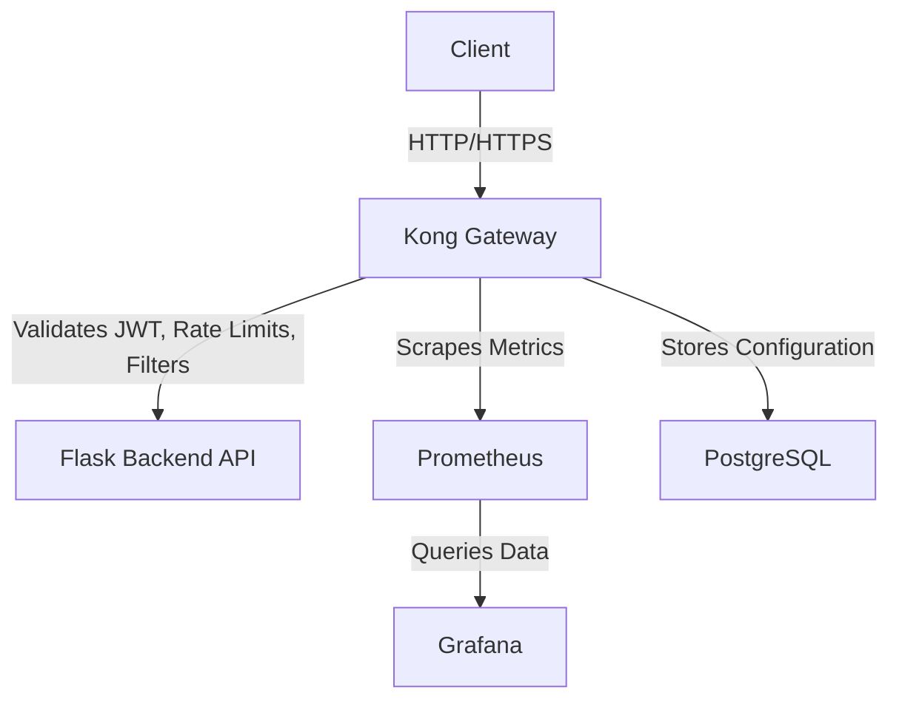

# Secure API Gateway Project

## Project Overview

This project implements a robust and extensible API Gateway using **Kong Gateway (Open Source)**, designed to showcase fundamental cybersecurity principles for protecting backend APIs. It provides a centralized control point for incoming traffic, enforcing critical security measures and offering comprehensive observability.

Developed as a capstone project for cybersecurity students, this setup demonstrates practical skills in API security, network traffic management, containerization, and monitoring within a realistic, self-contained environment.

## Key Features

  * **Centralized Authentication (JWT Validation):**
      * Kong Gateway acts as the primary authentication layer, offloading identity verification from backend services.
      * Validates JSON Web Tokens (JWTs) using configurable secrets/public keys, ensuring only authorized requests reach the APIs.
  * **Rate Limiting:**
      * Protects backend services from abuse, brute-force attacks, and Denial-of-Service (DoS) attempts.
      * Configured to limit request volumes per user or endpoint.
  * **Traffic Filtering (Basic WAF-like):**
      * Includes a **custom Lua plugin** that performs basic Web Application Firewall (WAF)-like checks.
      * Demonstrates how to inspect and block incoming requests containing common malicious patterns (e.g., SQL injection keywords).
  * **Observability & Monitoring:**
      * Integrated with **Prometheus** for robust metric collection from Kong Gateway.
      * Visualizes API traffic, performance metrics, and security events (e.g., rate limit hits, blocked requests) through interactive dashboards in **Grafana**.
  * **Containerized Deployment:**
      * All components (Kong Gateway, PostgreSQL, mock backend API, Prometheus, Grafana) are orchestrated using **Docker Compose**.
      * Provides a simple, reproducible, and isolated local development/demonstration environment.
  * **Mock Backend API:**
      * A lightweight Flask application serves as a simulated backend, with public, protected, and admin endpoints to demonstrate gateway functionality.

## Architecture

The project consists of the following components, orchestrated via Docker Compose:

1.  **Kong Gateway (`kong`):** The core API Gateway, handling routing, authentication, rate limiting, and traffic filtering.
2.  **PostgreSQL (`kong-database`):** Kong's declarative configuration data store.
3.  **Flask Backend API (`backend-api`):** A simple Python Flask application serving as the mock upstream API.
4.  **Prometheus (`prometheus`):** Scrapes metrics from Kong Gateway (and other services).
5.  **Grafana (`grafana`):** Provides dashboards to visualize the metrics collected by Prometheus.

<!-- end list -->



## Getting Started

Follow these steps to set up and run the project locally.

### Prerequisites

  * **Docker Desktop:** Ensure Docker Engine and Docker Compose are installed and running on your system.
      * [Download Docker Desktop](https://www.docker.com/products/docker-desktop/)
  * **Git:** For cloning the repository.
  * **cURL or Postman/Insomnia:** For testing API requests.
  * **A Text Editor/IDE:** (e.g., VS Code)

### Setup Instructions

1.  **Clone the Repository:**

    ```bash
    git clone https://github.com/your-username/secure-api-gateway.git
    cd secure-api-gateway
    ```


2.  **Verify/Create Configuration Files:**
    Ensure you have the following files in your project root (`secure-api-gateway/`):

      * `docker-compose.yml`
      * `kong.yml`
      * `prometheus.yml`

    And in the `backend-api/` subdirectory:

      * `backend-api/Dockerfile`
      * `backend-api/app.py`
      * `backend-api/requirements.txt`

    The contents for these files are provided in the project's source or previous setup instructions. **Crucially, ensure `backend-api/app.py` does NOT have `import jwt` or the `if __name__ == '__main__': app.run(...)` block.**

3.  **Build and Start Services:**
    This command will build your custom `backend-api` image (including `curl`), pull other necessary images, and start all containers in detached mode.

    ```bash
    docker compose up -d --build --no-cache
    ```

    *(The `--no-cache` flag ensures a clean build, especially after `Dockerfile` changes.)*

4.  **Verify All Containers are Running:**
    Give it about 30-60 seconds for all services to initialize. Then check their status:

    ```bash
    docker ps
    ```

    You should see `kong`, `kong-database`, `backend-api`, `prometheus`, and `grafana` all listed with `Status` as `Up (healthy)` (Kong might temporarily show `unhealthy` during its initial setup/scraping, but should resolve).

## Testing the API Gateway

### 1\. Test Backend API Directly (Bypass Gateway)

Confirm your mock Flask backend is accessible directly on your host machine.

  * **Public Endpoint:**
    ```bash
    curl http://localhost:5000/public
    # Expected: {"message": "This is a public endpoint."}
    ```
  * **Root Endpoint:**
    ```bash
    curl http://localhost:5000/
    # Expected: {"message": "Welcome to the Flask API!"}
    ```

### 2\. Test Public Endpoint (Through Kong Gateway)

Access the public endpoint routed through Kong.

```bash
curl -i http://localhost:8000/public
```

**Expected Output:**

```
HTTP/1.1 200 OK
Content-Type: application/json
...
{"message": "This is a public endpoint."}
```

### 3\. Test JWT Authentication (Protected Endpoint)

The `/protected` route requires a valid JWT.

**a. Generate a Test JWT (HS256):**

  * Go to [jwt.io](https://jwt.io/).
  * **Header:** `{"alg": "HS256", "typ": "JWT"}`
  * **Payload:**
      * `"sub": "test-user"`
      * `"exp": <a future Unix timestamp in seconds>` (Use [unixtimestamp.com](https://www.unixtimestamp.com/) for a future date/time).
      * `"iss": "your_hs256_secret_key_here"` **(IMPORTANT: This MUST match the `secret` defined for `test-user` in your `kong.yml` file exactly.)**
  * **Verify Signature Section:** Paste your `your_hs256_secret_key_here` into the "your-secret" field.
  * Copy the full generated JWT from the "Encoded" section.

**b. Test Unauthenticated Access:**

```bash
curl -i http://localhost:8000/protected
```

**Expected Output:**

```
HTTP/1.1 401 Unauthorized
{"message":"No credentials found for given 'iss'"}
```

**c. Test Authenticated Access:**
Replace `<YOUR_GENERATED_JWT>` with the token you copied.

```bash
curl -i -H "Authorization: Bearer <YOUR_GENERATED_JWT>" http://localhost:8000/protected
```

**Expected Output:**

```
HTTP/1.1 200 OK
{"message": "This is a protected endpoint! Access granted."}
```

### 4\. Test Rate Limiting (Admin Endpoint)

The `/admin` route has a rate limit of 5 requests per minute.

**a. Make multiple requests with a valid JWT:**

```bash
curl -i -X POST -H "Authorization: Bearer <YOUR_GENERATED_JWT>" http://localhost:8000/admin
```

  * **First 5 requests:** Should return `HTTP/1.1 200 OK`.
  * **Subsequent requests (within the minute):** Should return `HTTP/1.1 429 Too Many Requests` with `X-RateLimit-Remaining-Minute: 0` headers.

### 5\. Test Traffic Filtering (Custom WAF Plugin)

If you've enabled and configured the `sql-injection-filter` custom plugin (as described in the setup), you can test basic blocking.

```bash
curl -i "http://localhost:8000/public?q=SELECT%20*%20FROM%20users"
```

**Expected Output:**

```
HTTP/1.1 403 Forbidden
{"message": "Forbidden: Possible SQL Injection detected."}
```

*(You'll need to uncomment the plugin mounting and activation in `docker-compose.yml` and `kong.yml` for this feature to work.)*

## Monitoring with Prometheus & Grafana

1.  **Access Grafana:**
    Open your web browser and go to `http://localhost:3000`.

      * **Login:** `admin` / `admin_password` (you'll be prompted to change it).

2.  **Add Prometheus Data Source:**

      * In Grafana, go to **Configuration (gear icon) \> Data sources \> Add data source \> Prometheus**.
      * **Name:** `Prometheus`
      * **URL:** `http://prometheus:9090` (Grafana accesses Prometheus by its service name within the Docker network).
      * Click "Save & test".

3.  **Import Kong Dashboard:**

      * Go to **Dashboards \> Import**.
      * In "Import via grafana.com", enter ID `7424` (Kong Official Dashboard).
      * Select your "Prometheus" data source.
      * Click "Import".
      * Explore the dashboard to see metrics like request rates, latencies, HTTP status codes, and rate limiting data.

4.  **Access Prometheus UI (Optional):**
    Open `http://localhost:9090` in your browser. You can use the "Graph" tab to query metrics directly (e.g., `kong_http_requests_total`).

## Project Structure

```
secure-api-gateway/
├── docker-compose.yml              # Defines and orchestrates all Docker services
├── kong.yml                        # Kong Gateway's declarative configuration (services, routes, plugins, consumers)
├── prometheus.yml                  # Prometheus configuration for scraping metrics
├── backend-api/                    # Mock Flask backend API
│   ├── Dockerfile                  # Instructions for building the Flask API Docker image
│   ├── app.py                      # Flask application code
│   └── requirements.txt            # Python dependencies for Flask app
└── custom_plugins/                 # (Optional) Directory for custom Kong Lua plugins
    └── sql-injection-filter/
        ├── handler.lua             # Custom plugin logic
        └── schema.lua              # Plugin configuration schema
```

## Cleaning Up

To stop and remove all Docker containers, networks, and volumes created by this project:

```bash
docker compose down -v
```

This command removes containers and also cleans up the named volume (`kong_data`) used for PostgreSQL persistence.

